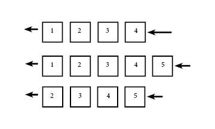

# Queues in Python
Created November 16, 2020  
Last Edited: 12/13/2020

## General Overview of Materials
- a queue
- performance of a queue
- how to implement queues
- FIFO  
<p>&nbsp;</p>

## What is a Queue  

A queue looks like the following.  

<p>&nbsp;</p>

## Performance of a queue
A queue has a O(n) performance due to the structure of the data structure.  
Since a queue is basically a list, looping through the list would be a O(n) performance  
because to go through every item in the queue, a for loop needs to be used.  

Displaying the queue will require a few things. In these examples, we will use the following  
code to create the new queues. The first class is Queue, and the queue will be held in
the queue class. Each value being added will be added through the Node class.  

The \_\_*str*\_\_() function is added to make the queue output a lot easier to read  
or understand.
<p>&nbsp;</p>

```python
class Queue:
    """
    This class holds the basic outline of a queue []. The main functions will
    be declared here.
    """

    class Node:
        """
        This will hold the data of the queue. For now, there will only be one
        value held in the __init__().
        """

        def __init__(self, value):
            self.value = value

        # need __str__ to print out object's value
        # if this is not added, would return place in memory of object
        def __str__(self):
            return f'{self.value}'

    # define the class as being a []
    def __init__(self):
        self.queue = []
    
    # str function overwrite
    # return str(node) to make everything string
    # (who knows what values could be put in here)
    def __str__(self):
        result = '['
        for node in self.queue:
            result += str(node) + ', '
        result = result[:-2]
        result += ']'
        return result

```  

<p>&nbsp;</p>

### Adding To a Queue
When adding to a queue, this is a simple O(1) performance. A queue works off of FIFO (First in First out)  
which means the first item to be added is the first item to be removed. In the image above, the first number is 1, then 2,  
and so forth. When the number 5 was added, it was added at the end of the queue. 

To add to a queue, the code would have to do the following:
  * create a new node to hold the value
  * add the new value to the end of the queue
<p>&nbsp;</p>

```python
    # create a function to add values to a queue
    def enqueue(self, value):
        new_node = Queue.Node(value)
        self.queue.append(new_node)
```

<p>&nbsp;</p>

### Removing From a Queue
When someone creates a queue, there are two possible ways that I know to create the queue. One is making  
a queue with a dynamic array as the base. Another way is to create the queue with a linked list, and this  
will be discussed in the next reading. For now, a simple way to explain a linked list is basically nodes  
that reference each other, so instead of being in a literal list, they are a list by reference.  
<p>&nbsp;</p>
With a dynamic array, the performance is O(n) since to dequeue values, the rest of the array must be moved  
to fill the gap of the first value. In a linked list, since the values are just referenced to each other,  
the value can be dequeued and the only thing to change is the reference of the other values. This would  
be an O(1) performance since only the references have to be change.  
<p>&nbsp;</p>
Imagine if there were 1 million and 1 values in a queue. In a dynamic array, the first value would be dequeued,  
and the million other values would have to be moved over to fill in the gap. This is not only a lot of data, but  
is a lot of time and processing the computer would have to do.  
<p>&nbsp;</p>
In a linked list, since all the values are just referenced to each other, there are three things that have to be done.  
First, the references to the first node from the second node have to be changed removed.  
Second, the second node must be made the head so it is the start of the linked list.
Third, the original first node must be removed. Since the references were already removed, this value would not be  
displayed when the queue is displayed, but to get rid of unnecessary items in memory, we should delete this value.

<p>&nbsp;</p>

Removing from a queue is not very hard. As mentioned earlier, it can be very performance heavy  
since it has to remove a value and shift over all of the other values. Try to do the following:
  * Set a value as the value to be removed
  * Delete the value from the queue
  * Print out the value dequeued (This is not required, but makes it more user friendly to see what is removed)
<p>&nbsp;</p>

```python
    # write a dequeue function
    def dequeue(self):

        # set a var as the value to be removed
        removal = self.queue[0]
        del self.queue[0]
        print(f'The value being removed is {removal}.\n')
```

<p>&nbsp;</p>

## When to Use a Queue
* When working with lines of people
* Orders in Fast Food
* Anything with order where the first person should leave first

<p>&nbsp;</p>

When creating a program, a queue is great when working with lists of people or data that has  
to be run through, while also having to remove the first person or thing in the queue. This  
is used in fast food when people order food. People add their order, and then get a number.  
This number determines what order the food should be made and delivered.  

<p>&nbsp;</p>

In a university, when students register for classes, they are added to the class in order of  
signing up for the class. In a database, these people are assigned an id value that starts with  
the first person and is incremented for each person that next adds the class. When the class is  
full, there is a waitlist for people who want to be in the class but there is not enough room  
for them. Using a queue, those people who are waitlisted can be put in a queue, and when someone  
drops the class, the first person in the waitlist can be removed from the waitlist and then  
added to the class itself.

<p>&nbsp;</p>

# Final Problem

For this final problem, I want you to create a queue that holds people in a classroom. Then, if  
they want to drop the class, drop them from the class. If the class is full, tell the user there  
is no space, and do not add them to the class. I would suggest doing the following:  
  * Create two classes (Queue and Node) to hold the queue and class size.  
  * Declare the size of a classroom.
  * Add at least half of the max capacity of people to the classroom.
  * Create a dequeue function to remove people if they want to be dropped.  
  * Define a \_\_*str*_\_() function to allow a pretty print of the data.  

<p>&nbsp;</p>

Return to [introduction](introduction.md) file.