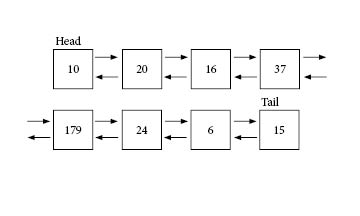

# Linked List

## What to talk about
 - Design of linked list (include image)
 - How does it link to each other
 - How does it save memory (uses space in memory instead of array of data)
 - When to use it
 - performance

<p>&nbsp;</p>

 ## Design of a linked list
 A linked list is a list of values that are not stored in a specific array. Instead, the values are stored in memory  
and are accesed by referencing the other values. In the image below, we think of a linked list as many nodes  
or boxes, and each node has a value. The first node is the first value, and is then references the next value.  
The first node is the *head*, or the first value. The last node in the list is the *tail*, or the end value.  

<p>&nbsp;</p>

The arrows in the image represent the references made between nodes. As you can see in this image, __10__ is the head,  
or the first value in the list. In this case, __10__ is referencing __20__ as the next value in the list. __20__ is  
referencing __10__ as the previous value in the list, and __16__ as the next value in the list. This goes on until the  
last value. In this case, __15__ is the last value in the list. __15__ references __6__ as the previous value, and  
__15__ is set as the tail of the linked list.  

<p>&nbsp;</p>


  

<p>&nbsp;</p>

## How Do They Link Together?  
Linked lists in our examples are going to be inside of classes to make it easier to work with and see.  
First off, we'll define a Linked_list class, and define a head and a tail. Notice that we are not currently  
assigning the head and tail any values, and that is because we don't have any values to input now.  

<p>&nbsp;</p>

```python
class Linked_list:

    def __init__(self):
        self.head = None
        self.tail = None

```

<p>&nbsp;</p>

Second, we are going to create that class to go inside of the Linked_list class. Here, we define a value,  
a next and a previous value. The value will hold the value inside the linked list. The next will be the  
reference to the next value in the list. The previous will do the same thing, but for the previous  
value in the list.  

<p>&nbsp;</p>

```python
class Linked_list:

    class Node:

        def __init__(self, value):
            self.value = value
            self.next = None
            self.previous = None

    def __init__(self):
        self.head = None
        self.tail = None

```
 
 <p>&nbsp;</p>

 ## Adding All Values
 - create linked list w/references to everything
 - Create that iter function to run through list
 - create function to sum all values (have them create that function)

 <p>&nbsp;</p>

 ```python

# refer to list_ex1.py file for full code

class Linked_list:
    """
    Create a linked list that holds the values of the head and the tail. Any other data
    to be held here will be within the inner class Data.
    """

    class Data:
        """
        Here will be the values held in the list. There will also be references to 
        the next itmes in the linked list.
        """

        # define the values held and the references to the next item in the list
        def __init__(self, value):
        self.value = value
        self.next = None
        self.prev = None


    # define the head and tail of the linked list
    def __init__(self):
        self.head = None
        self.tail = None


    # function to insert into list
    # user will specify if the item is to be placed in head or tail (one function for two purposes)
    def insert(self, value, place):
        # create a var to store the new data
        # change the var name later
        stuff = Linked_list.Data(value)


        # if there is no data, set the head and tail as the new data
        if self.head is None and self.tail is None:
            self.head = stuff
            self.tail = stuff

        else:
            # if place is 'head'
            if place.lower() == 'head':
                stuff.next = self.head    # connnect the old head to the new data
                self.head.prev = stuff    # connect the previous head to the new data
                self.head = stuff         # set the head to the new data

            elif place.lower() == 'tail':
                stuff.prev = self.tail    # connect the old tail to the new data
                self.tail.next = stuff    # connect the previous tail to the new data
                self.tail = stuff         # set the tail to the new data

 ```

 <p>&nbsp;</p>
 
 ## Storing Images Together  

 * Create a linked list  
 * Allow the user to type in the name of the image, along with the alt text  

 <p>&nbsp;</p>

For the coding assignment, I would like you to do the following:  
 1. Create a linked list  
 2. Allow the user to type in and store images in the list (or image paths)  
 3. Let the user type in the text to describe the image  
 4. Iterate through/display the images  

 <p>&nbsp;</p>

 ## When to Use Linked Lists
 * Better performance than arrays
 * Same as array, but faster and better to work with

 <p>&nbsp;</p>

The biggest difference between linked lists and arrays is when addding and removing from  
them. When inserting at the beginning of an array, the array has to resize itself and  
shift all of the data. When dealing with a lot of data, this could be a very costly  
operation. 

<p>&nbsp;</p>
 

Return to [introduction](introduction.md) file.