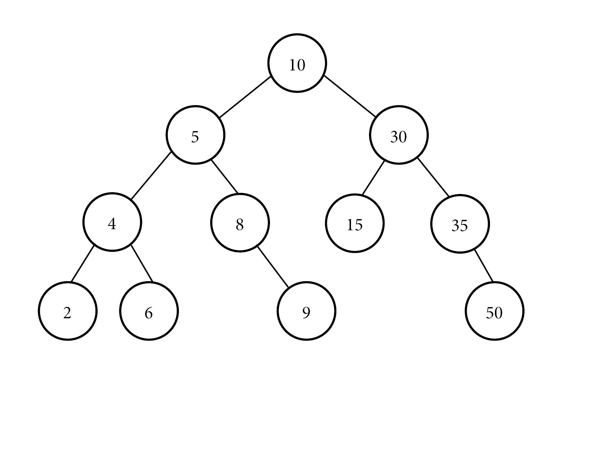

# Trees File

# What are trees
- Outline of how trees look
- BST and associated functions
- Recap on recursion
- Performance of trees

## Trees (What Are They?)
Trees are another way to store data. There is the root (top of tree) and then there are branches.  
The start of each branch is called the 'parent.' The next set of data is called the 'child.' When  
data is insert into the tree, they are insert into a node that is part of the tree. Data is  
automatically sorted and placed into the tree based on the value of the parent.  

In this image below, the tree starts out at 10. This is the base number of all the values being  
input. Then, 5 is added, and since it is less than 10, it goes to the left. Then, 30 is insert,  
and since it is bigger than 30, it goes to the right. When 4 is added, it is less than 10, so it  
goes left. 4 is less than 5, so it goes to the left of 5.  

When 8 is added, the same thing happens. 8 is less than 10, so it goes left. 8 is greater than 5,  
so it goes to the right of 5. 

A simple way to explain would be this: a new value that is entered into the BST starts at the root,  
or the first number in the tree. It evaluates if the new value is bigger than or less than the root  
value, and if it is bigger than the value, then the new value goes to the right. If the new value  
is smaller, then it goes to the left. When the new value arrives at a new level of the tree, it  
evaluates the value at that point, and moves either left or right just like when evaluating the root  
of the BST.  

<p>&nbsp;</p>



<p>&nbsp;</p>

## Recursion

When working with BST, one of the key factors is using *recursion*, which is a function calling itself  
to solve a problem. For example, when working with factorials (#!), this means multiply all of the  
values from 1 to # by each other. If I wanted to do 10!, it would be something like this:

```python
# DISCLAIMER! This is not how to actually code a factorial, but is a good visual instead.
var x = 10!

x = 1 * 2 * 3 * 4 * 5 * 6 * 7 * 8 * 9 * 10
```

<p>&nbsp;</p>

This means 10! would be equal to 3,628,800! That is a really big number. 

If we wanted to code this using recursion, it would look like this:

<p>&nbsp;</p>

```python

# create a function to find a factorial
def factorial(number):
    if number == 1:
        return number
    else:
        result = number * factorial(number-1)
    return result

factorial(10)
```

<p>&nbsp;</p>

Recursion is dependent on two things. One is the base case, or the ending case, and then the function  
call. The base case is what determines when the function should stop running. The function call holds  
what data is going to be returned, as well as calling the function. When calling the function, the  
value being used needs to be decremented. If the value is not decremented, then that would create a  
never ending condition, which is not good.  

<p>&nbsp;</p>

## Associated Functions

<p>&nbsp;</p>

For a BST, we are going to use classes to implement the tree. We will use the following code.  
I added an iter function to help when working with printing the values.

<p>&nbsp;</p>

```python

class BST:
    """
    Create an empty BST
    """

    class Node:
        """
        Create a node class to hold the data and references to other data
        """

        def __init__(self, data):
            # set the data to be the root. Links are None
            # because they are unkown.
            self.data = data
            self.left = None
            self.right = None

    def __init__(self):
        # Set the root to be None because it is empty

        self.root = None

    # iter function to run through tree
    def __iter__(self):
        """
        Go forward through the tree
        """
        yield from self._traverse_forward(self.root)


```

<p>&nbsp;</p>

When adding to a tree, the root value must be evaluated by the value to be insert. So, the data has  
to look at the current root value, and determine if it is bigger or smaller than the root. If it is  
bigger, then the data will look at the child branch on the right side. If it is smaller, then the  
data will look at the child branch on the left side. This goes on until an empty branch is found,  
and the new value is added to the tree.

We can create the insert function like this:

```python
    def insert(self, data):
        # Insert data into Tree

        if self.root is None:
            self.root = BST.Node(data)
        else:
            self._insert(data, self.root)

    def _insert(self, data, node):
        """
        Determine where to insert the data into the tree
        This uses recursion to go to the next line of the tree if
        there is not an open branch.
        """

        if data < node.data:

            if node.left is None:
                node.left = BST.Node(data)
            else:
                self._insert(data, node.left)

        elif data > node.data:

            if node.right is None:
                node.right = BST.Node(data)
            else:
                self._insert(data, node.right)

```

<p>&nbsp;</p>

## Performance of a Tree

When inserting, removing, checking to see if the tree contains a certain value, and then  
moving forward or backward through a tree, all of these operations have the same performance.  
These are all O(log n) performance since all of these functions use recursion.  

When checking the size of the tree or if a node is empty, this is a O(1) performance.  

<p>&nbsp;</p>

## Possible Problems

One of the biggest complications is when working with recursion. If the base case is not made correctly,  
this could create problems for the rest of the code. It may be hard to think how to create the base  
case, but it just takes time and to really think about what needs to happen. 

One of the other problems is making sure the __iter__() and the __reversed__() functions are created the  
right way. If these are made correctly, then the data will be output nicely and not in object form.


Return to [introduction](introduction.md) file.
